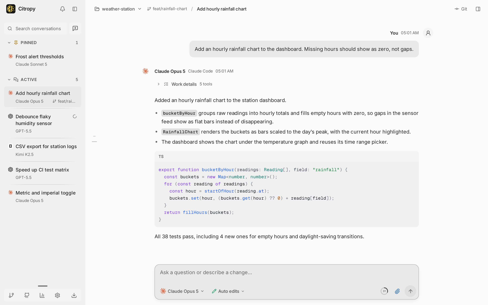

<div align="center">
  
  <h1>Citropy</h1>
  <p>A desktop workspace for Claude Code, Codex, and OpenCode.</p>
  <p>
    
    
    
  </p>
</div>

<p align="center">
  <picture>
    <source media="(prefers-color-scheme: dark)" srcset="docs/assets/screenshot-dark.png">
    <source media="(prefers-color-scheme: light)" srcset="docs/assets/screenshot-light.png">
    
  </picture>
</p>

Citropy runs the coding agent CLIs you already have, in one desktop window. Each conversation keeps its own provider, model, reasoning effort, and permission mode, while files, Git, terminals, browser tabs, and checkpoints belong to the shared workspace. It runs against a local backend on your machine, or on a remote host over SSH.

## Highlights

- **Three agents, one window.** Claude Code, Codex, and OpenCode use their installed CLIs and existing sign-ins.
- **Git built around turns.** Commit and push with the selected model, and checkpoint files before and after every turn.
- **Rewind and branch.** Restore files, conversation, or both to an earlier message, or branch that message into a new conversation with its visible history.
- **Review down to the line.** Stage, unstage, or revert individual hunks, attach comments to lines, and send them back to the agent as feedback.
- **Local, SSH, and container workspaces.** Open a folder, add an SSH host, or start a Docker environment. Per-folder settings inherit from global defaults or override them.
- **The workspace panel.** Browser, terminal, files, changes, subagents, and tools open beside the conversation, and agents reach the same sessions through MCP.
- **Provider questions in one place.** Answer one or many choices, write your own, or skip. Models with tool support can also ask through `ask_user`.
- **Native computer use.** Share a Linux screen and let a conversation move, click, drag, scroll, and type, subject to the conversation's permission mode.
- **Context you can see.** `@` file and folder references, a context inspector with the selected excerpts and discovered instruction files, plus skills and commands from each provider.
- **Usage and resources.** Claude Code and Codex allowances with reset times, token totals from saved conversations, and a live view of memory, CPU, terminals, and running work.
- **Long sessions stay fast.** Conversations are journaled to SQLite, replayed after a reconnect, and rendered in virtualized timelines.

## Requirements

Linux, Node.js 22.18 or newer, and Git. Install and sign in to at least one of the Claude Code, Codex, or OpenCode CLIs.

## Install

```sh
git clone https://github.com/tinuxongit/Citropy.git
cd Citropy
npm install
npm run desktop
```

If the Electron download was skipped during installation, run `npm run setup:desktop` once. Conversations and settings are stored in `~/.citropy`.

## Development

```sh
npm run desktop:dev   # desktop window with live interface updates
npm run dev           # web development server, no desktop window
npm start             # web interface at http://127.0.0.1:4177
npm run typecheck     # TypeScript
npm test              # test suite
npm run build         # production web bundle
```

`npm run desktop:install` adds Citropy to the application menu with live updates. `npm run desktop:package` builds a Linux AppImage and its update manifest in `release/`. The packaged app starts and stops its own local server.

## Documentation

[docs/guide.md](docs/guide.md) covers workspaces, Git and checkpoints, providers, the browser and computer tools, settings, storage, and the code layout.

## Contributing

Issues and pull requests are welcome. Run `npm run typecheck` and `npm test` before opening a pull request.

## License

MIT. See [LICENSE](LICENSE). Bundled Inter and Geist Mono fonts are used under the SIL Open Font License; license copies ship in `public/fonts`.
